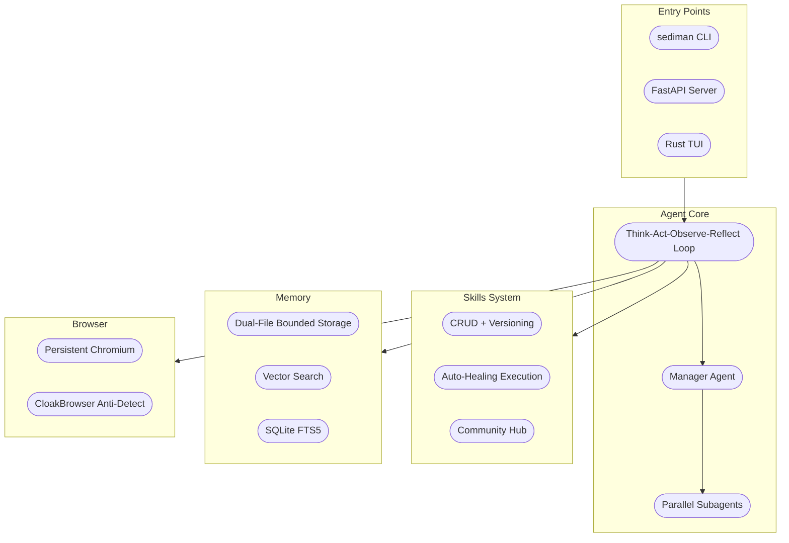

<div align="center">

# Sediman

**Your AI browser employee that works while you sleep.**

Teach it once. It repeats forever. 24/7.

[](LICENSE)
[]()
[](https://discord.gg/sediman)

</div>

---


---

## Install

```bash
curl -fsSL https://get.sediman.ai | bash
```

<details>
<summary>Alternative methods</summary>

```bash
# pip
pip install sediman-browse

# or from source
git clone https://github.com/sediman-agent/sediman-browse.git
cd sediman-browse && uv sync
```
</details>

Then:

```bash
sediman init          # set your API key
sediman run "..."     # headless one-shot
sediman chat          # interactive CLI
```

### TUI (Rust terminal UI)

```bash
bun run tui --provider openai --model gpt-4o
```

| Command | Description |
|---------|-------------|
| `/provider` | Select LLM provider |
| `/model` | Search or switch models |
| `/memory` | View and edit agent memory |
| `/skills` | List learned skills |
| `/schedule` | List scheduled jobs |
| `/help` | Show all commands |

---

## What It Does

| | Sediman | Browser Use | Scrapers | RPA Tools |
|---|---|---|---|---|
| Real browser (Playwright/Chromium) | Yes | Yes | No | Yes |
| AI-powered | Yes | Yes | No | No |
| **Learn by showing** | Yes | No | No | No |
| **Self-healing** | Yes | No | No | No |
| **24/7 scheduling** | Yes | No | Manual | Paid add-on |
| Persistent memory | Yes | No | No | No |
| Self-learning skills | Yes | No | No | No |
| Self-hosted | Yes | Yes | N/A | Enterprise pricing |

**Key features:**

- **Learn by Showing** — watch your browser once, replay anytime
- **Self-Healing** — pages change? Sediman patches itself automatically
- **Self-Learning** — after each task, saves reusable skills automatically
- **24/7 Scheduling** — cron-based automation, runs while you sleep
- **Skills Hub** — browse and install 470+ community skills
- **Persistent Memory** — remembers preferences across sessions
- **Parallel Subagents** — split complex tasks across multiple agents

---

<details>
<summary><strong>Architecture</strong></summary>



</details>

---

## Sediman Cloud

Managed hosting — instant browser sessions, always-on automation, no infrastructure. [Join the waitlist](https://sediman.ai).

---

## License

[Business Source License 1.1](LICENSE).

---

<div align="center">

**If this project helps you, consider giving it a star.**

[Report Bug](https://github.com/sediman-agent/sediman-browse/issues) · [Request Feature](https://github.com/sediman-agent/sediman-browse/issues) · [Discord](https://discord.gg/sediman)

</div>
